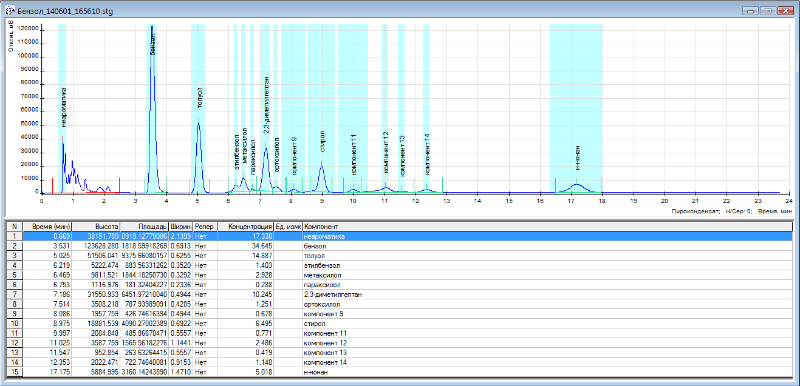

Пример чтения файла-хроматограммы из проекта Хромос

Результат работы программы с файлом Бензол_140601_165610.stg:

````
Sample: Пироконденсат
Duration: 23,80
Method: Бензол
 N           Height             Area    Concentration                 Name
01     38151,789418     10919,128290        17,338186          неароматика
02    123628,279959     21818,599863        34,645161               бензол
03     51506,040970      9375,661141        14,887357               толуол
04      5222,474205       883,562592         1,402986           этилбензол
05      9811,519911      1844,182954         2,928327           метаксилол
06      1116,974771       181,323925         0,287920           параксилол
07     31550,932609      6451,971425        10,244911    2,3-диметилгептан
08      3508,218500       787,941046         1,251148           ортоксилол
09      1957,760468       426,746654         0,677619          компонент 9
10     18881,539624      4090,270943         6,494829               стирол
11      2084,847810       485,866458         0,771495         компонент 11
12      3587,759005      1565,561202         2,485913         компонент 12
13       952,853930       263,633014         0,418615         компонент 13
14      2022,471050       722,746548         1,147629         компонент 14
15      5884,995502      3160,142671         5,017904              н-нонан
````

Файл Бензол_140601_165610.stg можно открыть используя программу Хромос.
Программу Хромос можно скачать отсюда: http://kb.has.ru/soft:soft
Без программы Хромос можно посмотреть файл screenshot.png


